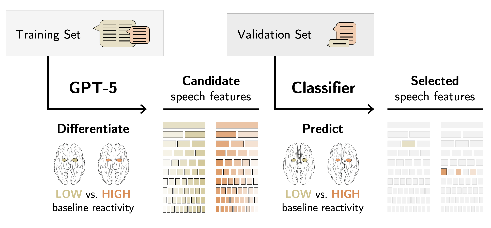
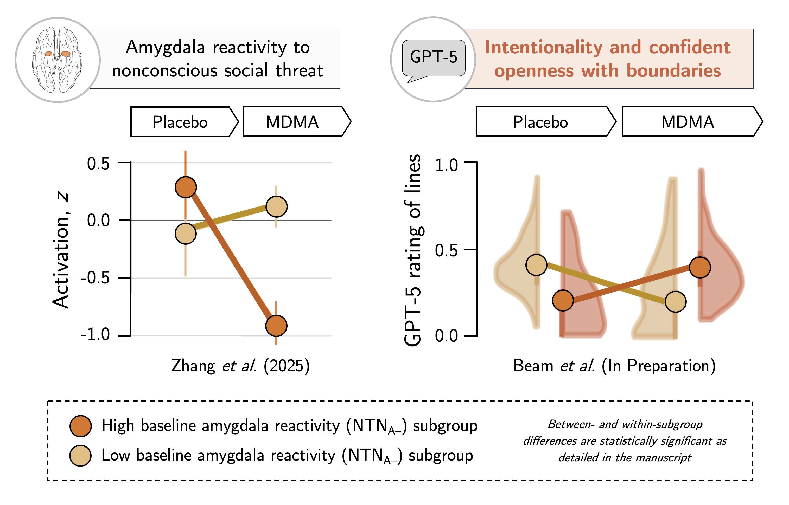
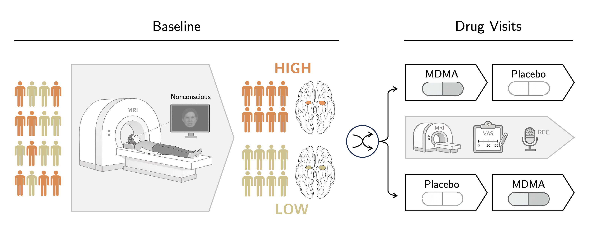

# Precision neurolinguistics reveals latent speech signatures of a negative affect biotype and its modulation by MDMA

#### Elizabeth H. Beam,<sup>1</sup> Xue Zhang,<sup>1</sup> Rachel Hilton,<sup>1</sup> Peter J. van Roessel,<sup>1,2</sup> Carolyn I. Rodriguez,<sup>1,2</sup> & Leanne M. Williams<sup>1,3,*</sup>

1.	Department of Psychiatry and Behavioral Sciences, Stanford University School of Medicine, Stanford, CA, USA
2.	Veterans Affairs Palo Alto Health Care System, Palo Alto, CA, USA
3.	Sierra-Pacific Mental Illness Research, Education and Clinical Center, Veterans Affairs Palo Alto Health Care System, Palo Alto, CA, USA

\* Corresponding author

## Overview

This is the code repository for the manuscript analyzing naturalistic speech in relation to MDMA-sensitive brain circuits, using generative AI (GPT-5) and standard NLP features to predict circuit-defined biotype subgroups.

Our manuscript introduces a novel precision neurolinguistics framework in which brain circuit stratification guides identification of latent speech signatures. We apply generative AI to characterize speech features that predict amygdala-reactivity biotype subgroups (NTN<sub>A–</sub> and NTN<sub>A+</sub>) under placebo and MDMA conditions, comparing performance against standard NLP-derived features. Below is an overview of our pipeline for deriving latent speech signatures with GPT-5:

<div align="center"></div>

In prior work by [Zhang <i>et al.</i>](https://jamanetwork.com/journals/jamanetworkopen/fullarticle/2833328), the NTN<sub>A+</sub> subgroup with high baseline amygdala reactivity to nonconscious social threat was shown to shift toward normalization of circuit function with MDMA. The above pipeline yielded a latent speech signature which in part describes a corresponding shift within the NTN<sub>A+</sub> subgroup from low interpersonal boundary openness during placebo to high interpersonal boundary openness with MDMA, as shown here:

<div align="center"></div>


## Study Background

- **Clinical trial:** Adults aged 18–55 with ≥2 prior MDMA uses (none within 6 months of dosing). Exclusion criteria included current/past mood, anxiety, substance use, eating, bipolar, or psychotic disorders. This study was approved by the Stanford University Institutional Review Board. All participants provided written informed consent.
- **Speech dataset:** Audio recorded in 11 participants across 27 drug visits (placebo, MDMA 80 mg, MDMA 120 mg).
  - **Placebo:** 8 recordings (4 NTN<sub>A–</sub>, 4 NTN<sub>A+</sub>)
  - **MDMA 120 mg:** 9 recordings (5 NTN<sub>A–</sub>, 4 NTN<sub>A+</sub>)

<div align="center"></div>

# Pipeline
Please see the ```manuscript.ipynb``` notebook for a walk-through of our pipeline. As study data are not included here, we have created an ```example.ipynb``` notebook which generates synthetic transcripts for prototypical NTN<sub>A–</sub> and NTN<sub>A+</sub> participants and shows how GPT-5 is applied to generate latent speech signatures.

## 1. Audio preprocessing & transcription
```transcribe.py```
- Speaker diarization (pyannote.audio).
- Transcription via OpenAI-Whisper (Large v3).
- Manual removal of participant identifiers from transcripts.
- Adjacent same-speaker utterances combined.
- Segmentation by rolling window to a maximum of 10, 20, or 30 seconds (30 seconds selected for best performance).

## 2. Candidate feature generation
```manuscript/features/send/model_send_audio.py```
```manuscript/features/send/model_send_text.py```
```featurize.py```

**NLP Features:**
- *Affective valence:* Fine-tuned LLMs on the Stanford Emotional Narratives Dataset (SEND).
  - Audio candidates: Wav2vec2, Whisper Medium (selected)
  - Text candidates: Llama-3.2, RoBERTa (selected)
- *Acoustic:* Speech rate, pause duration, local jitter, local shimmer, harmonicity, pitch variability (via Praat-Parselmouth).
- *Grammatical:* Word count, person/tense usage, hedges.

**GPT-5 Neurolinguistic Features**
- *Stage 1:* GPT-5 generates candidate features differentiating "low" (NTNA–) vs. "high" (NTNA+) reactivity transcripts. Each feature includes a title, one-sentence summary, and descriptive paragraph. Repeated to generate sets of 1–10 features over 3 iterations → 30 feature sets per subgroup per condition.
- *Stage 2:* GPT-5 rates the degree to which each feature is present in each utterance on a continuous scale from 0.0 to 1.0.


## 3. Candidate feature filtering
```featurize.py```

- Features excluded if they did not trend toward a difference between NTNA subgroups (Mann-Whitney U test, FDR < 0.1 after correction).
- Data split at the participant level to avoid inflation of validation/test performance.


## 4. Feature selection by logistic regression
```featurize.py```

- Logistic regression predicting NTNA subgroup.
- *Solver:* L-BFGS
- *Intercept:* Included
- *Iterations:* Up to 1,000
- *Tolerance 0.0001.
- *Regularization:* L2 
- *Inverse of regularization strength (C):*
  - NLP placebo model: C=0.25
  - NLP MDMA model: C=0.5
  - GPT-5 placebo model: C=0.5
  - GPT-5 MDMA model: C=0.5
  
## 5. Statistical analysis
```utils.py```

- Nonparametric statistics throughout (small samples, non-normal features).
- Mann-Whitney U tests, Spearman rank correlations, Common Language Effect Size (CLES).
- Model accuracy with 95% CIs estimated by resampling over 10,000 iterations.

## Requirements

All analyses were conducted with **Python 3.12.2** within a Conda environment.

### Core Dependencies

| Package | Version | Purpose |
|:--------------------|:-------------|:-----------------------------------------------|
| OpenAI-Whisper | v20231117 | Audio transcription (Large v3 model) |
| Transformers | 4.47.0 | Fine-tuning LLMs (affective valence) |
| Pydub | 0.24.1 | Silence/pause detection |
| Praat-Parselmouth | 0.4.6 | Acoustic feature extraction (Praat) |
| SciPy | 1.13.1 | Mann-Whitney U tests, Spearman correlations |
| Statsmodels | 0.14.2 | FDR correction (Benjamini-Hochberg) |
| scikit-learn | 1.4.2 | Logistic regression classifiers |


### Suggested Installation

```bash
conda create -n neurolinguistics python=3.12.2
conda activate neurolinguistics
pip install scikit-learn==1.4.2 scipy==1.13.1 statsmodels==0.14.2 \
            transformers==4.47.0 openai-whisper==20231117 \
            pydub==0.24.1 praat-parselmouth==0.4.6
```

# Data Availability
Participant speech data are subject to IRB and consent restrictions; please contact the corresponding author regarding access. The Stanford Emotional Narratives Dataset (SEND) used for affective valence models is partly publicly available (112 videos with consent for future use; train 48.21% / validation 24.11% / test 27.68%). 

# Citations
If you use this code, please cite the associated manuscript:
- Beam, E., Zhang, X., Hilton, R., van Roessel, P. J., Rodriguez, C. I., & Williams, L. M. (In Preparation). Precision neurolinguistics reveals latent speech signatures of a negative affect biotype and its modulation by MDMA.

Please also cite relevant toolkits:
- Pedregosa, F. et al. Scikit-learn: Machine learning in Python. J. Mach. Learn. Res. 12, 2825–2830 (2011).
- Virtanen, P. et al. SciPy 1.0. Nat. Methods 17, 261–272 (2020).
- Seabold, S. & Perktold, J. Statsmodels. Proc. 9th Python in Science Conf. 57, 92–96 (2010).
- Wolf, T. et al. Transformers. EMNLP System Demonstrations 38–45 (2020).
- Radford, A. et al. Robust speech recognition via large-scale weak supervision. ICML 202, 28492–28518 (2023).
- Jadoul, Y., Thompson, B., & de Boer, B. Introducing Parselmouth. J. Phon. 71, 1–15 (2018).
- Ong, D. C., Wu, Z., Zhi-Xuan, T. et al. Modeling emotion in complex stories: the Stanford Emotional Narratives Dataset. IEEE Trans. Affect. Comput. 12, 579–594 (2021).

# Funding
This work was supported by Research Center of Excellence Award P50DA042012 from the NIDA (overall center principal investigator, Karl Deisseroth; Project 4 principal investigator, Leanne Williams) and grant UL1TR003142-01 from Stanford’s Clinical and Translational Science Award Program overseen by the National Center for Advancing Translational Sciences at the NIH. We thank Resilient Pharmaceuticals, Inc., formerly Lykos Therapeutics and previously MAPS Public Benefit Corporation, for providing the study drug (40-mg MDMA hydrochloride and matched placebo pills) used in this trial. Research fellowship support for Elizabeth Beam was provided by 2T32MH019938-31.

# License & Copyright
[](https://opensource.org/licenses/MIT)

Copyright (c) 2026 Elizabeth Beam, MD, PhD